# 📬 Notification Flow - EventFlow System

## Overview
Dokumentasi lengkap alur notifikasi dalam sistem EventFlow, termasuk tipe notifikasi, kategori report, dan delivery method.

---

## 🏷️ Tipe Notifikasi (NotificationType)

| Tipe | Label | Warna | Deskripsi | Use Case |
|------|-------|-------|-----------|----------|
| `REPORT_FEEDBACK` | Feedback Report | 🟢 Hijau | Feedback untuk laporan yang dibuat participant | Organizer update status report participant |
| `EVENT_UPDATE` | Event Update | 🔵 Biru | Update informasi event | Perubahan jadwal, lokasi, status event |
| `SECURITY_ALERT` | Security Alert | 🔴 Merah | Peringatan keamanan darurat | Broadcast laporan SECURITY ke semua participant |
| `GENERAL` | General | ⚪ Abu-abu | Notifikasi umum | Pengumuman biasa |

---

## 📊 Kategori Report (ReportCategory)

| Kategori | Warna Badge | Icon | Contoh |
|----------|-------------|------|---------|
| `SECURITY` | 🔴 Merah | 🚨 | Kebakaran, pencurian, keributan |
| `FACILITY` | 🟠 Orange | 🏥 | Toilet rusak, AC mati, lampu padam |
| `CROWD` | 🟡 Kuning | 👥 | Kepadatan berlebih, antrean panjang |
| `OTHER` | ⚫ Abu-abu | 📝 | Lainnya |

---

## 📮 Delivery Method

| Method | Badge | Deskripsi |
|--------|-------|-----------|
| `INDIVIDUAL` | - | Notifikasi dikirim ke 1 user spesifik |
| `BROADCAST` | 🟣 Ungu | Notifikasi dikirim ke semua participants |

---

## 🔄 Flow Skenario

### Skenario 1: Update Status Report (Organizer → Participant)

**Participant membuat report → Organizer memberikan feedback**

```mermaid
sequenceDiagram
    participant P as Participant
    participant BE as Backend
    participant O as Organizer
    
    P->>BE: POST /reports/:eventId<br/>(FACILITY: "Toilet rusak")
    BE->>O: Socket: liveReport
    BE->>O: Notification (REPORT_FEEDBACK)<br/>type: REPORT_FEEDBACK<br/>deliveryMethod: INDIVIDUAL
    
    Note over O: Review report di Dashboard
    O->>BE: PATCH /reports/:reportId/status<br/>{status: "IN_PROGRESS", adminNotes: "Sedang diperbaiki"}
    BE->>P: Notification (REPORT_FEEDBACK)<br/>type: REPORT_FEEDBACK<br/>category: FACILITY<br/>deliveryMethod: INDIVIDUAL
    
    Note over P: Terima notifikasi:<br/>🟢 Feedback Report<br/>🟠 [FACILITY]<br/>"Laporan Anda...diupdate ke IN_PROGRESS"
```



**Detail Backend:**
```typescript
// reportController.ts - updateReportStatus()
const notif = await createNotification({
  title: 'Status Laporan Diupdate',
  message: `Laporan Anda tentang ${report.category} telah diupdate ke: ${status}${adminNotes ? ' - ' + adminNotes : ''}`,
  type: 'REPORT_FEEDBACK', // ✅ Benar
  eventId: report.eventId,
  category: report.category, // FACILITY
  deliveryMethod: 'INDIVIDUAL',
  userNotifications: {
    create: [{ user: { connect: { id: report.reporterId } } }]
  }
});
```

**Tampilan di Frontend:**
```
┌─────────────────────────────────────┐
│ ┃ FEEDBACK REPORT [FACILITY]        │ ← Border hijau, badge orange
│ ┃ Status Laporan Diupdate           │
│ ┃ Laporan Anda tentang FACILITY     │
│ ┃ telah diupdate ke: IN_PROGRESS -  │
│ ┃ Sedang diperbaiki                 │
└─────────────────────────────────────┘
```

---

### Skenario 2: Broadcast Report (Organizer → All Participants)

**Report darurat di-broadcast ke semua participants**

```mermaid
sequenceDiagram
    participant P1 as Participant A
    participant BE as Backend
    participant O as Organizer
    participant P2 as All Participants
    
    P1->>BE: POST /reports/:eventId<br/>(SECURITY: "Api di zona A")
    BE->>O: Socket: liveReport
    BE->>O: Notification (REPORT_FEEDBACK)<br/>type: REPORT_FEEDBACK<br/>category: SECURITY
    
    Note over O: Review report<br/>Putuskan perlu broadcast
    O->>BE: POST /reports/:reportId/broadcast<br/>{broadcastMessage: "EVAKUASI! Api di zona A", severity: "high"}
    BE->>P2: Socket: eventBroadcast<br/>Notification (SECURITY_ALERT)<br/>type: SECURITY_ALERT<br/>category: SECURITY<br/>deliveryMethod: BROADCAST
    
    Note over P2: Terima notifikasi darurat:<br/>🔴 Security Alert<br/>🔴 [SECURITY] 🟣 [BROADCAST]<br/>"Pengumuman: SECURITY..."
```



**Detail Backend:**
```typescript
// reportController.ts - broadcastReport()
const notification = await createNotification({
  title: `Pengumuman: ${report.category}`,
  message: broadcastMessage || `${report.description.substring(0, 150)}...`,
  type: report.category === 'SECURITY' ? 'SECURITY_ALERT' : 'EVENT_UPDATE',
  eventId: report.eventId,
  category: report.category, // SECURITY
  deliveryMethod: 'BROADCAST',
  userNotifications: {
    create: participants.map((p) => ({
      user: { connect: { id: p.userId } }
    }))
  }
});

emitEventBroadcast(report.eventId, {
  id: notification.id,
  title,
  message,
  type: notification.type, // SECURITY_ALERT
  eventId: report.eventId,
  category: report.category, // SECURITY
  createdAt: notification.createdAt
});
```

**Tampilan di Frontend:**
```
┌─────────────────────────────────────┐
│ ┃ SECURITY ALERT [SECURITY] 📢      │ ← Border merah, badge merah + ungu
│ ┃ Pengumuman: SECURITY              │
│ ┃ EVAKUASI! Api di zona A.          │
│ ┃ Harap segera menuju pintu keluar  │
└─────────────────────────────────────┘
```

---

### Skenario 3: Custom Notification (Manual dari Organizer)

**Organizer mengirim notifikasi manual**


**Detail Backend:**
```typescript
// notificationController.ts - createBroadcast()
const prismaNotification = await createNotification({
  eventId,
  category, // null (tidak dari report)
  message,
  title,
  type: notifType, // GENERAL / EVENT_UPDATE / SECURITY_ALERT
  deliveryMethod: 'BROADCAST',
});

// Assign ke semua participants
await Promise.all(participants.map(async (p) => {
  await createUserNotification({
    notification: { connect: { id: prismaNotification.id } },
    user: { connect: { id: p.userId } },
  });
}));

emitNotification(notification);
```

**Tampilan di Frontend:**
```
┌─────────────────────────────────────┐
│ ┃ EVENT UPDATE 📢                   │ ← Border biru, badge broadcast
│ ┃ Acara Dimulai                     │
│ ┃ Pembukaan akan segera dimulai     │
│ ┃ dalam 10 menit                    │
└─────────────────────────────────────┘
```

---

## 🎨 Visual Component Mapping

### DashboardPage - Notification Display

```jsx
// src/pages/DashboardPage.jsx
const getNotifTypeLabel = (type) => {
  switch(type) {
    case 'REPORT_FEEDBACK': return 'Feedback Report';
    case 'EVENT_UPDATE': return 'Event Update';
    case 'SECURITY_ALERT': return 'Security Alert';
    case 'GENERAL': return 'General';
    default: return 'Notification';
  }
};

const getBorderColor = (type) => {
  switch(type) {
    case 'REPORT_FEEDBACK': return 'border-green-500';
    case 'EVENT_UPDATE': return 'border-indigo-500';
    case 'SECURITY_ALERT': return 'border-red-500';
    case 'GENERAL': return 'border-gray-500';
    default: return 'border-indigo-500';
  }
};

const getCategoryBadge = (category) => {
  if (!category) return null;
  const colors = {
    SECURITY: 'bg-red-100 dark:bg-red-900/30 text-red-700 dark:text-red-400',
    FACILITY: 'bg-orange-100 dark:bg-orange-900/30 text-orange-700 dark:text-orange-400',
    CROWD: 'bg-yellow-100 dark:bg-yellow-900/30 text-yellow-700 dark:text-yellow-400',
    OTHER: 'bg-gray-100 dark:bg-gray-800 text-gray-700 dark:text-gray-400'
  };
  return <span className={`text-[9px] font-bold uppercase ${colors[category]}`}>
    {category}
  </span>;
};
```

---

## 📋 Matrix Kombinasi Notifikasi

| Skenario | Type | Category | DeliveryMethod | Tampilan Label | Badge 1 | Badge 2 |
|----------|------|----------|----------------|----------------|---------|---------|
| Organizer update report FACILITY | `REPORT_FEEDBACK` | `FACILITY` | `INDIVIDUAL` | 🟢 Feedback Report | 🟠 FACILITY | - |
| Organizer update report SECURITY | `REPORT_FEEDBACK` | `SECURITY` | `INDIVIDUAL` | 🟢 Feedback Report | 🔴 SECURITY | - |
| Broadcast report SECURITY | `SECURITY_ALERT` | `SECURITY` | `BROADCAST` | 🔴 Security Alert | 🔴 SECURITY | 🟣 BROADCAST |
| Broadcast report FACILITY | `EVENT_UPDATE` | `FACILITY` | `BROADCAST` | 🔵 Event Update | 🟠 FACILITY | 🟣 BROADCAST |
| Manual broadcast umum | `GENERAL` | `null` | `BROADCAST` | ⚪ General | - | 🟣 BROADCAST |
| Manual notif ke 1 orang | `EVENT_UPDATE` | `null` | `INDIVIDUAL` | 🔵 Event Update | - | - |

---

## 🔧 Backend API Endpoints

### 1. Create Report (Participant)
```http
POST /reports/:eventId
Authorization: Bearer {token}
Content-Type: multipart/form-data

{
  "category": "SECURITY",
  "description": "Api di zona A",
  "latitude": -6.208943,
  "longitude": 106.799135,
  "media": [file1, file2]
}
```

**Notifikasi yang dibuat:**
- Ke Organizer: `type: REPORT_FEEDBACK`, `category: SECURITY`, `deliveryMethod: INDIVIDUAL`

---

### 2. Update Report Status (Organizer)
```http
PATCH /reports/:reportId/status
Authorization: Bearer {token}
Content-Type: application/json

{
  "status": "IN_PROGRESS",
  "adminNotes": "Sedang ditangani tim keamanan"
}
```

**Notifikasi yang dibuat:**
- Ke Reporter: `type: REPORT_FEEDBACK`, `category: {report.category}`, `deliveryMethod: INDIVIDUAL`

---

### 3. Broadcast Report (Organizer)
```http
POST /reports/:reportId/broadcast
Authorization: Bearer {token}
Content-Type: application/json

{
  "broadcastMessage": "EVAKUASI! Api di zona A",
  "severity": "high"
}
```

**Notifikasi yang dibuat:**
- Ke All Participants: 
  - Jika `report.category === 'SECURITY'`: `type: SECURITY_ALERT`
  - Jika bukan: `type: EVENT_UPDATE`
  - `category: {report.category}`, `deliveryMethod: BROADCAST`

---

### 4. Custom Notification (Organizer)
```http
POST /notifications/custom
Authorization: Bearer {token}
Content-Type: application/json

{
  "eventId": "event123",
  "participantId": "user456",
  "title": "Reminder",
  "message": "Jangan lupa check-in",
  "type": "GENERAL"
}
```

**Notifikasi yang dibuat:**
- Ke 1 Participant: `type: {type}`, `category: null`, `deliveryMethod: INDIVIDUAL`

---

### 5. Broadcast Custom (Organizer)
```http
POST /notifications/broadcast
Authorization: Bearer {token}
Content-Type: application/json

{
  "eventId": "event123",
  "title": "Acara Dimulai",
  "message": "Pembukaan dalam 10 menit",
  "type": "EVENT_UPDATE"
}
```

**Notifikasi yang dibuat:**
- Ke All Participants: `type: {type}`, `category: null`, `deliveryMethod: BROADCAST`

---

## 🚀 Real-time Socket Events

### Event: `notification`
Dikirim saat notifikasi individual dibuat
```javascript
socket.on('notification', (notif) => {
  // notif = { id, title, message, type, eventId, category, createdAt }
  setNotifications((prev) => [notif, ...prev]);
});
```

### Event: `eventBroadcast`
Dikirim saat notifikasi broadcast dibuat
```javascript
socket.on('eventBroadcast', (broadcast) => {
  // broadcast = { id, title, message, type, eventId, category, createdAt }
  setNotifications((prev) => [broadcast, ...prev]);
});
```

### Event: `liveReport`
Dikirim saat report baru dibuat (ke organizer)
```javascript
socket.on('liveReport', (reportPayload) => {
  // reportPayload = { reportId, userId, message, mediaUrl, createdAt, category, ... }
  setReports((prev) => [newReport, ...prev]);
});
```

---

## ✅ Checklist Implementation

### Backend ✅
- [x] `createReport`: Kirim notifikasi REPORT_FEEDBACK ke organizer
- [x] `updateReportStatus`: Kirim notifikasi REPORT_FEEDBACK ke reporter dengan category
- [x] `broadcastReport`: Kirim notifikasi SECURITY_ALERT/EVENT_UPDATE ke all participants
- [x] `createBroadcast`: Support manual broadcast dari organizer
- [x] `sendCustomNotification`: Support notifikasi individual manual

### Frontend ✅
- [x] Display notification type label (Feedback Report, Event Update, etc.)
- [x] Display category badge (SECURITY, FACILITY, CROWD, OTHER)
- [x] Display delivery method badge (BROADCAST)
- [x] Border color sesuai notification type
- [x] Socket listener untuk `notification` dan `eventBroadcast`
- [x] Real-time update notification list di Dashboard

---

## 📝 Notes

1. **REPORT_FEEDBACK vs EVENT_UPDATE**
   - `REPORT_FEEDBACK` = Feedback khusus untuk laporan yang dibuat participant
   - `EVENT_UPDATE` = Update umum tentang event (jadwal, lokasi, pengumuman)

2. **Category Field**
   - Hanya ada di notifikasi yang berasal dari report
   - Notifikasi manual tidak memiliki category (null)

3. **Broadcast Otomatis**
   - Report SECURITY yang di-broadcast → `type: SECURITY_ALERT`
   - Report lainnya yang di-broadcast → `type: EVENT_UPDATE`

4. **Priority Handling**
   - `SECURITY_ALERT` → High priority (merah)
   - `REPORT_FEEDBACK` → Medium priority (hijau)
   - `EVENT_UPDATE` → Normal priority (biru)
   - `GENERAL` → Low priority (abu-abu)

---

**Last Updated:** December 7, 2025  
**Version:** 1.0.0  
**Maintainer:** eventFlow Team
